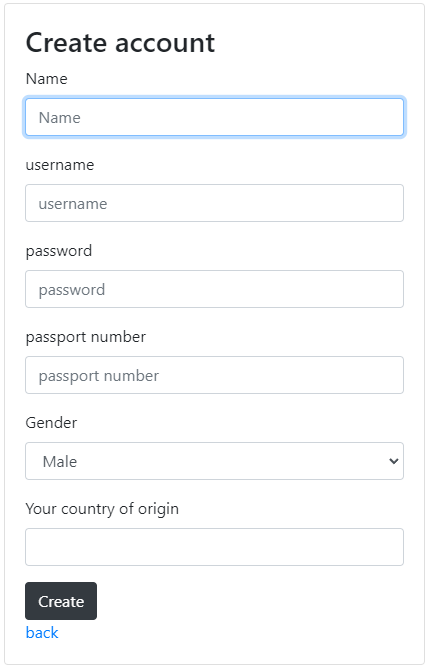
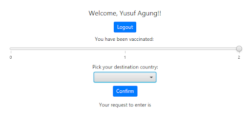
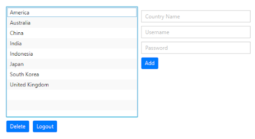

# cotrip19

A simple Java application for checking wether a tourist can travel to a specific country with its number of vaccinations

## Sample Screenshots
### Auth
#### Landing Page

#### Create Account Page

#### Login Page

### Home
#### Tourist Page

A tourist can check wether they can travel to a country in its current state (open/closed) and their vaccination numbers.
#### Country Rep Page

A country reps can edit their country to set wether it is open/closed.
#### Admin Page

Admin page is used for admins to administrate the country lists and create account for each country reps.
